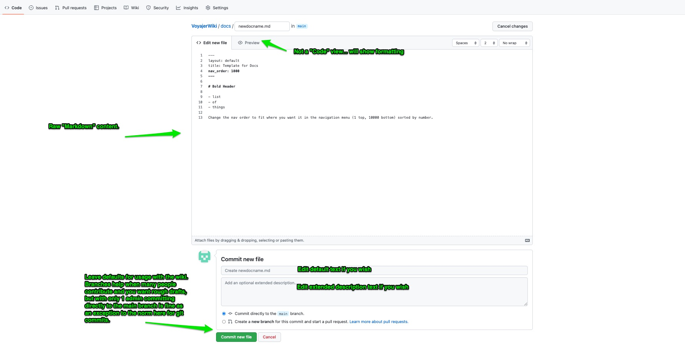

# Voyajer Wiki
{: .fs-9 }

The Voyajer Wiki contains references for the Voyajer system to support users and technology teams.
{: .fs-6 .fw-300 }

[User Guide](#getting-started){: .btn .btn-primary .fs-5 .mb-4 .mb-md-0 .mr-2 } [System Status](https://status.salesforce.com/alias/roadrebel){: .btn .btn-green .fs-5 .mb-4 .mb-md-0 } &nbsp;[Submit Request](docs/submitticket){: .btn .btn-blue .fs-5 .mb-4 .mb-md-0 }

## Getting started
The wiki uses Github and their product "Github Pages" to use existing "Jekyll" templates to create a site.  There is a theme called "Just the Docs" that is set to be used, and is managed with the code files listed in the repository.  For simple editing and adding you can do that directly on Github.com and a couple button clicks.  The usual Github/Git benefits of version control for contributors is not needed if there aren't multiple people contributing and overwriting eachother, so we use Github basically as a webhost in this case, with the option to be extended out to a version controlled Project for a team if necessary.

### Contributing
The Voyajer Wiki uses markdown as a syntax for the documentation pages, which is descirbed in detail here:

Files would need to get into the repository directly from Github.com or through an established connection in VSCode.

### Quick start: Use Github.com UI to Add Entry
1. Navigate to the repository URL and [into the "docs" folder](https://github.com/sarahroadrebel/VoyajerWiki/tree/main/docs).

2. If needed request access to be a contributor, otherwise just be logged in with your current Github username.

#### **Adding a file**
1. Files can be created or edited directly in the Github UI, and the changes saved and committed to the KB.


2. Adding a new file will require giving it a name and contents, while using "Markdown" language to support formatting.  Here is a template that can be used:


```
---
layout: default
title: Template for Docs
nav_order: 1000 
---

# Bold Header

- list
- of
- things

Change the nav order to fit where you want it in the navigation menu (1 top, 10000 bottom) sorted by number.

```

3.  After adding details, Commit your changes via the buttons at the bottom.



4.  Done!  Your file will be live on the site after 1 minute, after the build script on github runs and adds your page.  If it doesn't add in 10 minutes, check email for errors.


#### **Updating a file**

1. Upating is almost the same as the above adding steps, with the exception of navigating to the file in the repository and hitting the "Edit" button.  After that all the same steps still apply and you can commit your changes when complete.

2. Edit button:


3.  After adding details, Commit your changes via the buttons at the bottom.


4.  Done!  Your file will be live on the site after 1 minute, after the build script on github runs and adds your page.  If it doesn't add in 10 minutes, check email for errors.


### VSCode Setup for Wiki
More advanced setups can utilize a VSCode or any IDE setup and commit changes via a text editor, but that is overkill for a very small setup and will be left out.

### References
- [setting up wiki editing in vscode details](https://sarahroadrebel.github.io/VoyajerWiki/docs/technicaldocumentation/setupvscode/)
- [markdown reference](https://www.markdownguide.org/basic-syntax/)

Video for updating and adding:
<iframe width="560" height="315" src="https://www.youtube.com/embed/MsHUn29qmWg" title="YouTube video player" frameborder="0" allow="accelerometer; autoplay; clipboard-write; encrypted-media; gyroscope; picture-in-picture" allowfullscreen></iframe>
